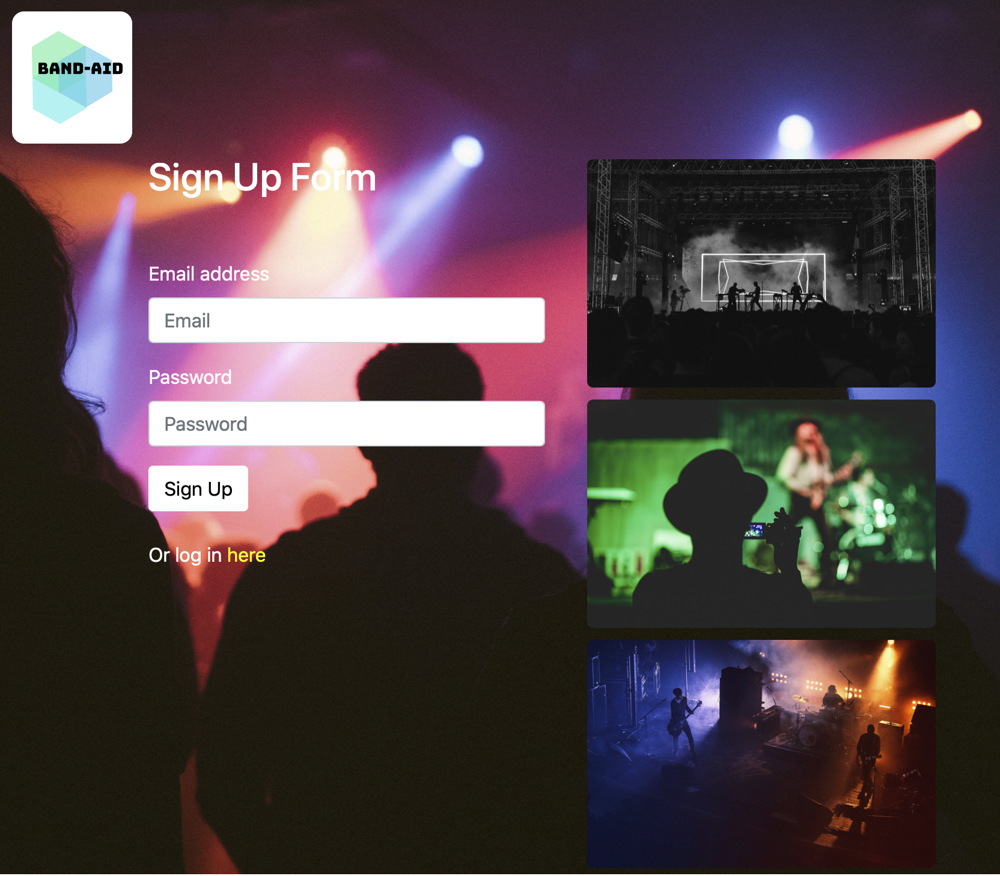

# Band-Aids

## Deployed

[Access the deployed web application here.](https://band-aids.herokuapp.com)

## User Story

```
AS A fan of various music genre,
I WANT to get a quick update of my favorite bands/ group/ artist playing locally,
So that I reduce the time of making useless searches.
```
## Description

This application allows for new user to sign-up or login to Band-Aid to share, explore, and discover music events happening around the world. Once the User has signed-up, they will receive an email from the development team welcoming them to the Band-Aid family

## Tech

This application leverages:

* HTML
* CSS
* Boostrap
* NodeJS
* Express
* Node mailer
* MySQL
* Sequalize
* Heroku
* Git-Hub
* ES Lint



## Collaborators

* [Zach Greenberg](https://github.com/Zach-Greenberg)
* [Austin Lambert](https://github.com/AusLam212)
* [Mario Diosdado](https://github.com/MarioDiosdado)
* [Emmanuel Stephen](https://github.com/Manii-dot)
* [Prem Gelivi](https://github.com/geliviprem)
